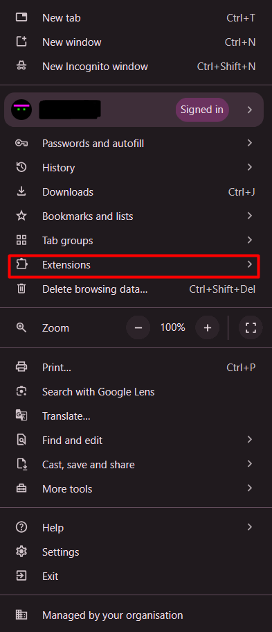
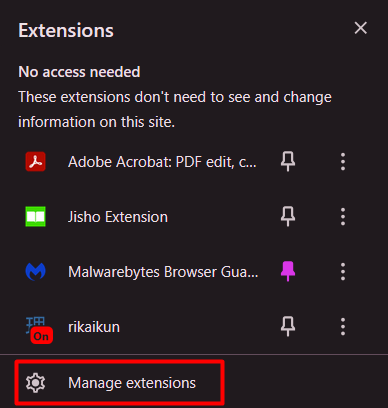
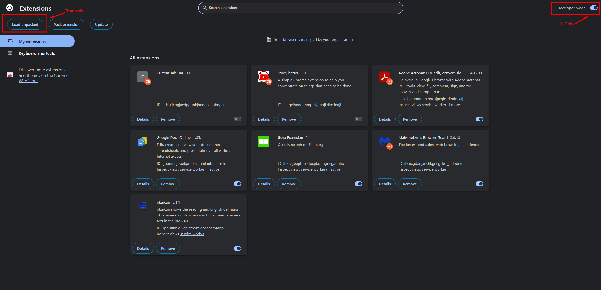

# Study better extension README file
 
This is a chrome extension to help you study better by immediately closing your unwanted tabs such as youtube, instagram or tiktok. This can be changed in the websites.txt . This extension is extremely user unfriendly. 
 
 
> For the record, I do NOT know any javascript and this project was made using mostly copilot 

## Here is a guide for setting the extension up:

 

> First, go here
 

 

> Or alternatively, go here (this should have been the first step, but I do it this way :P )
 

 

> Then, click on manage extensions
 

 

> Then, click on load unpacked
 

## Enjoy!
